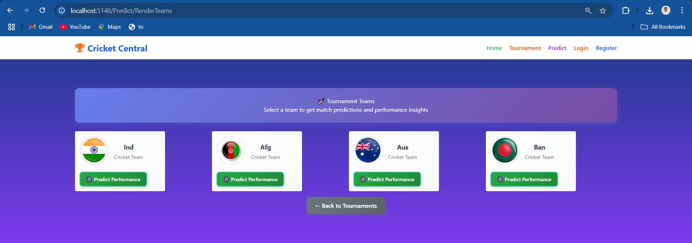

# CrickInfo - Cricket Tournament Management System

A comprehensive cricket tournament management system built with .NET Core MVC that combines tournament management, live data scraping, and advanced prediction algorithms using graph theory.

## 🏏 Features

### Core Management System
- **Tournament Management**: Create, update, delete, and manage cricket tournaments
- **Team Management**: Complete CRUD operations for team registration and management
- **Match Management**: Schedule matches, update scores, and track match results
- **Points Table**: Automatic calculation and display of tournament standings

### Advanced Features
- **Live Data Integration**: Web scraping from Cricbuzz for real-time IPL 2025 data
- **Predictive Analytics**: Advanced team finishing position prediction using Maximum Flow algorithms on bipartite graphs

## 🛠️ Technology Stack

- **Backend**: .NET Core 6.0 MVC
- **Database**: Entity Framework Core with SQL Server
- **Authentication**: ASP.NET Core Identity
- **Web Scraping**: Python Fast API 
- **Algorithm**: Maximum Flow (Ford-Fulkerson) implementation for predictions
- **Frontend**: HTML5, CSS3, Bootstrap 5, JavaScript

## 🧮 Maximum Flow Prediction Algorithm

### Algorithm Overview

The prediction system uses **Maximum Flow on Bipartite Graphs** to determine if a team can mathematically finish in the top positions. This approach models the tournament as a flow network where:

- **Source**: Connects to remaining matches
- **Match Nodes**: Represent unplayed matches
- **Team Nodes**: Represent each team
- **Sink**: Connects to final positions

## 🎨 User Interface

### Application Screenshots

#### Home Dashboard

*Home Page*

#### Authentication

*Secure user authentication with login / registration capabilities*

#### Tournament Management

*Tournament management interface with CRUD operations*

*Create/Edit tournament form with validation*

#### Team Management

*Team roster and statistics management*

#### Match Management

*Match scheduling and results tracking*

*Match creation and score entry interface*

#### Points Table

*Live tournament standings with sorting and filtering*

#### Prediction System

*Main prediction interface showing tournaments*

*Select team for prediction *

*Projected final standings based on algorithm*

## 🤝 Contributing

1. Fork the repository
2. Create a feature branch (`git checkout -b feature/new-feature`)
3. Commit your changes (`git commit -am 'Add new feature'`)
4. Push to the branch (`git push origin feature/new-feature`)
5. Create a Pull Request

## 👥 Authors

- **Madariya Kanji** - *Initial work* - [kevalmadariya](https://github.com/kevalmadariya)

## 🙏 Acknowledgments

- Cricbuzz for providing cricket data
- .NET Core community for excellent documentation
- Graph theory algorithms
- Bootstrap team for responsive UI components

---
*Built with ❤️ for cricket enthusiasts and data science lovers*
